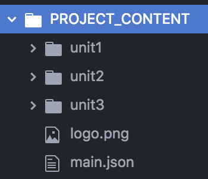
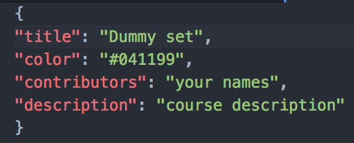
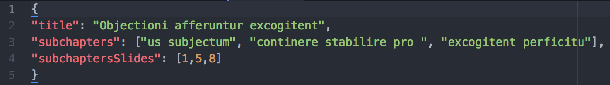

Publishing a webpage with your lecture slides in 10min
====

<!-- TOC -->

- [1.1. What is it?](#11-what-is-it)
- [1.2 How to use it? (Short version)](#12-how-to-use-it-short-version)
- [1.3 How to use it? (Long version)](#13-how-to-use-it-long-version)

<!-- /TOC -->
<br>

## 1.1. What is it?

This software builds up on [Express JS](http://expressjs.com/), a popular framework for Node JS, and [React JS](https://reactjs.org/), a JS library for building user interfaces. Further, it is deployed to [Heroku](https://www.heroku.com/home), where the content of the lecture is built into the fully functional web page.

Have a look at the example:
- https://test-uzh.herokuapp.com/
<br>


## 1.2 How to use it? (Short version)

To use it yourself you need to do the following:

1. **Setup the necessary infrastructure:**

  Install [Git](https://git-scm.com/download/win) **(for Windows users only)**
  <br> Get a [Heroku account](https://www.heroku.com/home):
    - Create an  account
    - Create a new app
    - Choose 'Heroku Postgres' in the Add-on list
    - Set ```ALLOW_COMMENTS``` config variable to ```true``` or ```false``` on the settings tab.

2. **Prepare your slide deck:**

  <br>Convert presentation slides, define folder structure, define menu structure and appearance

  - *Create content:*
  <br>Export presentation files as JPEG or PNG files. Files will be in the ascending order based on the digits in their names.

  - *Define order of presentation files:*
  <br> Copy the image files to a folder. A folder defines a chapter, i.e. top-level entry. Folders will be sorted in the ascending order based on the digits in their names. Use naming to create desired order of your chapters. Move them to the ```PROJECT_CONTENT``` folder.
  - *Set up chapter and subchapter names in details.json:*
  <br>In the ```main.json``` specify a title, contributors and a background colour.
  - *Set up chapter and subchapter names in details.json:*
  <br>Name the chapters and create/name subcapters, i.e. a second-level menu structure. Create ```details.json``` files with details on the presentations in every folder.
  - *Place a logo (if any):*
  <br>Place a logo in the ```PROJECT_CONTENT``` folder. Name it 'logo'. File extension is not important.

3. **Publish:**

  Push entire project to your heroku repository.

<br>

## 1.3 How to use it? (Long version)

To use it yourself you need to do the following:

1. **Setup the necessary infrastructure:**

  Get a Heroku account and download the software to your local machine.
  - *Git*
  <br>Mac OS users have the Terminal app with preinstalled git. Windows users should [install git separately](https://git-scm.com/download/win)
  - *Heroku:*
  <br>Heroku will host your webpage free of charge.
      - Go to the [Heroku main page](https://www.heroku.com/home) and register an account.
      - Download and install [Heroku CLI](https://devcenter.heroku.com/articles/heroku-cli).
      - Create a new application in your dashboard. The chosen name will become the part of the webpage url, choose wisely. Choose Europe as your region.
      - Before you the deployment of your webpage, you have to configure the following in your heroku account:
        1. Open your app from the dashboard, go to the "Resources" tab and in the Add-on input field search for the "Heroku Postgres". Once it appears in the list, click on it, choose "Hobby-Dev", the free plan, and press "Provision" button.
        2. Open your app from the dashboard, go to the settings tab and choose "Reveal Config Vars". If you successfully completed the previous step, you will see one defined configuration variable, ```DATABASE_URL```. Add a new one called ```ALLOW_COMMENTS``` and set it either to ```true``` if you want the comment block to be displayed on your page or ```false``` otherwise.

    <br>
  - *Local copy of the project*

    - Go to the [GitHub repository with the project](https://github.com/cookiehunter22/react-server-slideshow)
    - Click "Clone or Download" button and choose "Download ZIP"

    <br>
2. **Prepare your slide deck**: <br>Convert presentation slides, define folder structure, define menu structure and appearance

    - *Create content:*
<br>Export presentation files as JPEG or PNG files. File will be sorted in the ascending order based on the digits in their names. I suggest using names like ```'slide01', 'img1', '1pic' ``` or similar.
        - Export all slides of a presentation files as JPEG or PNG files and store them in a new folder, e.g. "unit_01".
        - Repeat this for every presentation file.

   - *Place "unit" folders inside the project:*
<br> Go to the folder ```PROJECT_CONTENT``` in your local copy of the project downloaded in the previous step and place there all your "unit_xx" folders. Every "unit" will represent a chapter / a lecture. Folders will be sorted in the ascending order based on the digits in their names. I suggest using names like ```'abc_01', 'abc1', '1abc' ``` or similar.
        - The folder structure look like this:

        <br>
        <br>

   - *Configure "main.json":*
 <br> "main.json" is the main config file. Please, use the [JSON syntax](https://www.w3schools.com/js/js_json_syntax.asp) in this file. Here you can specify:
    - The title of you project, that will be displayed on the page and in the browser's tab.
    - Background color in any [CSS supported format](https://www.w3schools.com/cssref/css_colors_legal.asp)
    - List contributors.
    - Provide project description.

    <br>Here is an example of the "main.json":

    <br>

  - *Configure "details.json":*
<br>Name the chapters and create/name subcapters, i.e. a second-level menu structure. Create "details.json" files with details on the presentations in every folder.
    - In each folder, store a .JSON file with the particular chapter title (as a string) as well as the respective subchapter titles (as an array of strings) and the corresponding slides' numbers (as an array of integers)
    - The .JSON files should look like this:

    <br>

  - *Place a logo (if any) in the ```PROJECT_CONTENT``` folder:*
<br>If you want to place a logo on your webpage, simply move an image to the root of the ```PROJECT_CONTENT``` folder. The format is not important. However, you must name the file **logo**.[any_extention].

  Finally your ```PROJECT_CONTENT``` folder must look like that:

  <br>

3. **Publish:**
<br>Push files to your Heroku repository. Make sure that the [Heroku CLI](https://devcenter.heroku.com/articles/heroku-cli) is installed on your computer.
    - Open command line and navigate to your project root (entire project, but not the ```PROJECT_CONTENT``` folder):
    ```
    cd path/to/your/project
    ```
    - Initiate git repository:
    ```
    git init
    ```
    - Add files to git:
    ```
    git add .
    ```
    - Commit your changes:
    ```
    git commit -m "I am ready to publish"
    ```
    - Connect to your remote repository on heroku (you can find the link on the application page, 'Deploy' tab):
    ```
    heroku git:remote -a name-of-your-app
    ```
    - Publish your webpage with a push:
    ```
    git push heroku master
    ```
4. **Disable/Enable Comments:**
<br>If you want to disable/enable commenting on your page, simply navigate to your app's settings tab and switch ```ALLOW_COMMENTS``` config variable to ```false``` / ```true``` respectively.

5. **Generating Reports:**
<br>You webpage has an out-of-the-box reporting functionality. You can generate a report about commenting activity simply by hitting the  ```https://YOUR-APP-NAME.herokuapp.com/api/report``` endpoint. 
